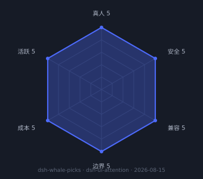
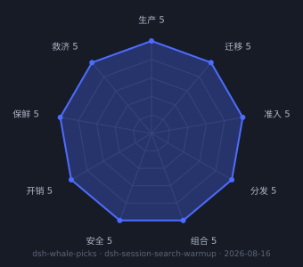
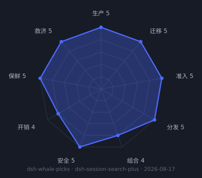

<!-- ⚠️ GENERATED by scripts/render-readme.mjs from data/plugins.json — do not edit by hand. Edit the registry, then run: npm run render -->

# 🐳 dsh-whale-picks · 鲸选

**敢装，值得装。** —— DeepSeek Harness (`dsh`) 插件精品商店。

[中文](README.zh.md) | [English](README.md)

    

> 大列表告诉你**有什么**。雷达告诉你**能不能跑**。
> 鲸选告诉你**敢不敢装、值不值得装**。

[DeepSeek Harness](https://github.com/deepseek-ai/deepseek-harness) (`dsh`) 是 DeepSeek 的开源 agent harness，万物皆插件。生态里躺着几千个候选仓库；本店只收创始人**亲手装过、亲手验过**的插件。每件上架都经过机器安全体检；每件正式收录都有九维兑现度雷达评分、创始人手记和公开的审核决定。**宁缺毋滥——货架少，但件件有出处。**

## Tiers · 分级

- 🏆 **编辑精选 · Featured** — 创始人亲测 + 安全体检 + 九维兑现度雷达评分通过门槛
- ✅ **已收录 · Listed** — 与编辑精选同门槛（转正后的候选）
- 🧪 **候选池 · Candidates** — 机器体检已完成，待创始人亲测转正

每个条目都带有确切的安装命令。多数插件用 `dsh plugin --profile <name> add <package>` 安装；安装前请先阅读对应仓库的 README。

## Contents

- [🏆 编辑精选](#featured)
- [🧪 候选池](#candidates)
- [安全与体检方法](docs/security-report.md)
- [选品宪章](docs/charter.md) · [评分标准](docs/rubric.md) · [决定流水](docs/decisions.md)
- [参与](CONTRIBUTING.md) · [路线图](docs/roadmap.md)

## <a id="featured"></a>🏆 编辑精选 · Featured

### 通知与提醒

- [dsh-ui-attention](https://github.com/LeeKai233/dsh-ui-attention) — DSH Web 操作提醒：页面不在前台时，用浏览器通知、提示音、标题闪烁提醒待处理交互与回合完成
  <br><sub>1⭐ · MIT · 实测于 dsh 0.1.0-rc.6 (2026-08-15)</sub>

  > **创始人手记**: 创始人自研的提醒插件，每天在用：页面在后台时，提问、审批、回合完成都靠它推送。纯本地实现，零网络请求；浏览器通知权限只在用户手势中申请。注意：bundle 安装与手工 patch 安装二选一，绝不能同时使用（会报 duplicate loader entry id）。

  <sub>创始人评分 5/5 · Founder score 5/5</sub>

  

  ```sh
  dsh plugin --profile web add dsh-ui-attention
  ```

### 其他

- [dsh-session-search-warmup](https://github.com/LeeKai233/dsh-session-search-warmup) — DSH 会话搜索预热：进程启动的安静窗口内静默构建官方 SQLite FTS5 索引，让官方搜索第一次查询即毫秒级响应
  <br><sub>0⭐ · MIT · 实测于 dsh 0.1.0-rc.6 (2026-08-16)</sub>

  > **创始人手记**: 大语料下官方搜索首次查询要几十秒、语料不静默时甚至永远建不成索引——这个插件在启动安静窗口替你建好索引，之后每次搜索都是毫秒级。纯宿主态、零网络、只调官方服务，Unix 单功能的教科书形态；它还逼范式补上了纯宿主态豁免，是范式覆盖面的第一次真实扩张。2026-08-16 实测（dsh 0.1.0-rc.6）：预热后首次查询 9–29ms，索引覆盖全部 22 条会话共 12702 段文档。

  <sub>创始人评分 5/5 · Founder score 5/5</sub>

  

  ```sh
  dsh plugin --profile web add dsh-session-search-warmup
  ```

- [dsh-session-search-plus](https://github.com/LeeKai233/dsh-session-search-plus) — DSH 会话搜索框增强：自建内存索引毫秒检索，vscode 风格 Aa/ab/.*/fz 模式开关（大小写/全词/正则/模糊），每会话多命中下拉，锚点精确跳转并页内高亮框选
  <br><sub>0⭐ · MIT · 实测于 dsh 0.1.0-rc.6 (2026-08-17)</sub>

  > **创始人手记**: 官方搜索在大语料下内容检索近乎不可用；本插件用内存索引（仅 user/assistant 文本块）把内容搜索做到毫秒级，vscode 风格内联模式开关（Aa 大小写 / ab 全词 / .* 正则 / fz 模糊）、每会话多命中下拉与 seq 锚点跳转——定位直接读运行时 chat 快照的 anchorSeq，折叠的 context 注入行先自动展开再标记。选中态在命中行（头部不亮），其下拉层级线常驻；关搜索后点页面任意处清除填充与框选。2026-08-17 实测（Playwright + dsh 0.1.0-rc.6）：搜 npm 跳转后填充高亮 1 处、页内框选 97 处全部正确；深历史命中约 15s 翻页后精确定位；选中态/层级线/清标记三项线上复测通过；范式迁移后 --strict 全绿。npm 0.2.0 已发布。已知代价：深历史跳转受官方 50 条/页翻页限速；fuzzy 默认关（散列子序列命中在 DOM 无连续串可标）。与 dsh-session-search-warmup 互补。

  <sub>创始人评分 4/5 · Founder score 4/5</sub>

  

  ```sh
  dsh plugin --profile web add dsh-session-search-plus
  ```


## <a id="candidate"></a>🧪 候选池 · Candidates

机器体检已完成，待创始人亲测后转正。试用体验、踩坑记录欢迎在 Issues 反馈——好的反馈会加速转正。

### 发现与管理

- [dshmarket](https://github.com/dsh-market/dsh-market) — 装在 DSH 里的插件市场：300+ 插件浏览、搜索、一键安装/更新/卸载、主题一键切换
  <br><sub>1027⭐ · none · 机器体检 2026-08-15 · 规范门槛 ✗（待补 whalepicks.json） · ⚠️ 1 项待复核 · [体检发现](docs/security-report.md#dsh-market)</sub>

  ```sh
  dsh plugin --profile web add dshmarket
  ```

- [dsh-plugin-workshop](https://github.com/yyyyukari/dsh-plugin-workshop) — Steam 工坊式插件浏览器：搜索、热门/最新排序、一键安装卸载，零服务器（GitHub 直连）
  <br><sub>25⭐ · MIT · 机器体检 2026-08-15 · 规范门槛 ✗（待补 whalepicks.json） · [体检发现](docs/security-report.md#dsh-plugin-workshop)</sub>

  ```sh
  dsh plugin --profile web add "github:yyyyukari/dsh-plugin-workshop"
  ```

- [dsh-find-plugin](https://github.com/awesome-dsh-plugin/dsh-find-plugin) — 在会话里让 agent 帮你找插件：实时搜索 GitHub dsh-plugin topic，按 star 排序，附安装命令
  <br><sub>56⭐ · MIT · 机器体检 2026-08-15 · 规范门槛 ✗（待补 whalepicks.json） · [体检发现](docs/security-report.md#dsh-find-plugin)</sub>

  ```sh
  dsh plugin --profile web add dsh-find-plugin
  ```

- [dsh-whale-picks-store](https://github.com/LeeKai233/dsh-whale-picks-store) — 鲸选商店入口：在 DSH 设置侧栏「Agent 预设」下方加入鲸选，浏览套件与精选插件、btop 风格九轴米表（CSS 渲染、nord 配色，任意显示器与缩放观感一致）、创始人评分与体检结论，一键复制安装命令
  <br><sub>0⭐ · MIT · 机器体检 2026-08-15 · 规范门槛 ✓ · [体检发现](docs/security-report.md#dsh-whale-picks-store)</sub>

  ```sh
  dsh plugin --profile web add dsh-whale-picks-store
  ```

### UI 与皮肤

- [dsh-appearance](https://github.com/LeeKai233/dsh-appearance) — 外观协调器：在 DSH 设置中新增「外观」页，统一注册、开关与体检外观类插件（冲突/危险/性能检查，基于各插件声明的鲸选清单）
  <br><sub>0⭐ · MIT · 机器体检 2026-08-16 · 规范门槛 ✓ · [体检发现](docs/security-report.md#dsh-appearance)</sub>

  ```sh
  dsh plugin --profile web add dsh-appearance
  ```

- [dsh-statusbar](https://github.com/LeeKai233/dsh-statusbar) — tmux 风格状态栏：替换输入框下方统计行，左为统计信息与 DeepSeek 余额（三色阈值提醒），右为地点/温度/逐小时预报/日出日落
  <br><sub>0⭐ · MIT · 机器体检 2026-08-16 · 规范门槛 ✓ · [体检发现](docs/security-report.md#dsh-statusbar)</sub>

  ```sh
  dsh plugin --profile web add dsh-statusbar
  ```

- [dsh-web-ui](https://github.com/zhu1090093659/dsh-web-ui) — Web UI 插件与皮肤合集：任务板、Git 图谱、右侧面板、移动端 UI 等，聚合包装一键全装
  <br><sub>4541⭐ · Apache-2.0 · 机器体检 2026-08-15 · 规范门槛 ✗（待补 whalepicks.json） · [体检发现](docs/security-report.md#dsh-web-ui)</sub>

  ```sh
  dsh plugin --profile web add @linxin666/dsh-web-ui-all
  ```

- [dsh-skin](https://github.com/KinGao294/dsh-skin) — 皮肤切换器 + 自定义壁纸：多套精选调色板、半透明壁纸与透明度控制
  <br><sub>19⭐ · MIT · 机器体检 2026-08-15 · 规范门槛 ✗（待补 whalepicks.json） · ⚠️ 1 项待复核 · [体检发现](docs/security-report.md#dsh-skin)</sub>

  ```sh
  dsh plugin --profile web add dsh-skin
  ```

### 终端与桌面

- [dsh-tianshu-tui](https://github.com/huiliyi37/dsh-tianshu-tui) — DSH 终端 UI（TUI）：在终端里交互式使用 DeepSeek Harness，含 harness workflow 渲染
  <br><sub>212⭐ · Apache-2.0 · 机器体检 2026-08-15 · 规范门槛 ✗（待补 whalepicks.json） · [体检发现](docs/security-report.md#dsh-tianshu-tui)</sub>

  ```sh
  dsh plugin --profile tui add @huiliyi37/dsh-tianshu-tui
  ```

- [deepseek-harness-tui](https://github.com/openma-ai/deepseek-harness-tui) — Rust/ratatui 终端客户端：直连 DSH SDK JSON-RPC，可独立运行或作为 profile bundle
  <br><sub>40⭐ · MIT · 机器体检 2026-08-15 · 规范门槛 ✗（待补 whalepicks.json） · [体检发现](docs/security-report.md#deepseek-harness-tui)</sub>

  ```sh
  dsh plugin --profile tui add @openma/deepseek-harness-tui
  ```

- [deepseek-harness-desktop](https://github.com/anywhere-labs/deepseek-harness-desktop) — DSH 现代化桌面端：免 Node.js 与命令行；插件市场与移动端远程控制在路线图上
  <br><sub>13496⭐ · MIT · 机器体检 2026-08-15 · 规范门槛 ✗（待补 whalepicks.json） · ⚠️ 1 项待复核 · [体检发现](docs/security-report.md#deepseek-harness-desktop)</sub>

### 多 Agent 与工作流

- [dsh-agent-teams](https://github.com/NanmiCoder/dsh-agent-teams) — AgentTeams 插件：多 agent 团队协作编排（角色、任务分配与回合流转）
  <br><sub>548⭐ · MIT · 机器体检 2026-08-15 · 规范门槛 ✗（待补 whalepicks.json） · [体检发现](docs/security-report.md#dsh-agent-teams)</sub>

  ```sh
  dsh plugin --profile web add @nanmicoder/dsh-agent-teams
  ```

### 用量与统计

- [dsh-usage-stats](https://github.com/Make0209/dsh-usage-stats) — GitHub 风格用量热力图：Token / 缓存命中 / 账户余额看板 + 工作区别名管理
  <br><sub>18⭐ · MIT · 机器体检 2026-08-15 · 规范门槛 ✗（待补 whalepicks.json） · ⚠️ 1 项待复核 · [体检发现](docs/security-report.md#dsh-usage-stats)</sub>

  ```sh
  dsh plugin --profile web add dsh-usage-stats
  ```


## 🐳 Suits · 套件

暂无套件——等已收录插件攒到可以组合的数量，套件会出现在这里（组合标准见 [docs/suits.md](docs/suits.md)）。宁缺毋滥，不造假。

## Security · 安全与体检

每个条目（包括候选）在上架前都要过一遍机器安全体检：许可证文件、npm 发布与防冒名 repository 指针校验、近 6 个月维护活跃度、红旗扫描。完整方法学与局限见[体检报告](docs/security-report.md)。

> ⚠️ **体检不是审计。** 安装插件等于在你的机器上运行第三方代码——它能读你的文件、使用你的凭据、访问网络。收录不代表 DeepSeek 官方背书；安装前请自查源码。

## Related · 大卖场

本店刻意不做数量。大卖场们覆盖了广的部分：

- [awesome-dsh-plugin/awesome-dsh-plugin](https://github.com/awesome-dsh-plugin/awesome-dsh-plugin) — 有什么（大而全的精选列表）
- [AdamPlatin123/awesome-dsh-plugins](https://github.com/AdamPlatin123/awesome-dsh-plugins) — 能不能跑（雷达 + k8s 实测）
- [dshworks/awesome-dsh-plugins](https://github.com/dshworks/awesome-dsh-plugins) — 机器可读数据（1028 条）
- [dsh-market/dsh-market](https://github.com/dsh-market/dsh-market) — DSH 内置安装市场

按 dsh **0.1.0-rc.6** 维护 · registry 更新于 2026-08-18。[路线图](docs/roadmap.md)：商店网站、DSH 内置鲸选插件、评分与讨论区。

## License

MIT © 2026 Leslie (LeeKai233) —— 代码与 registry 数据。
